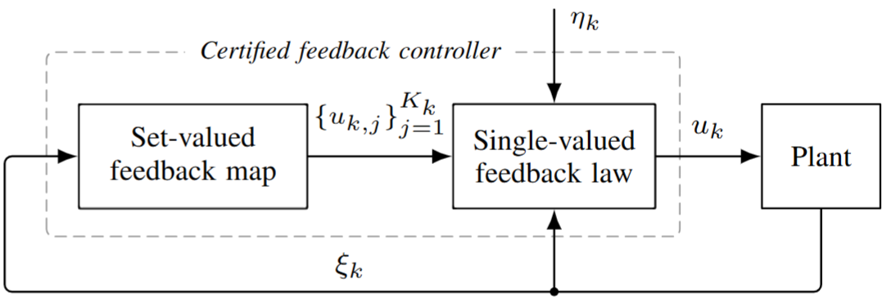
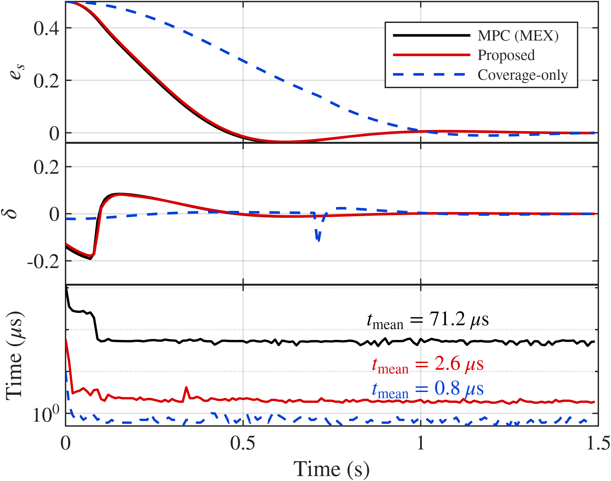
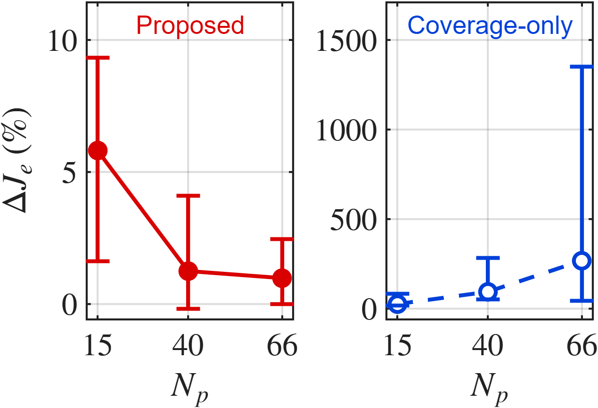
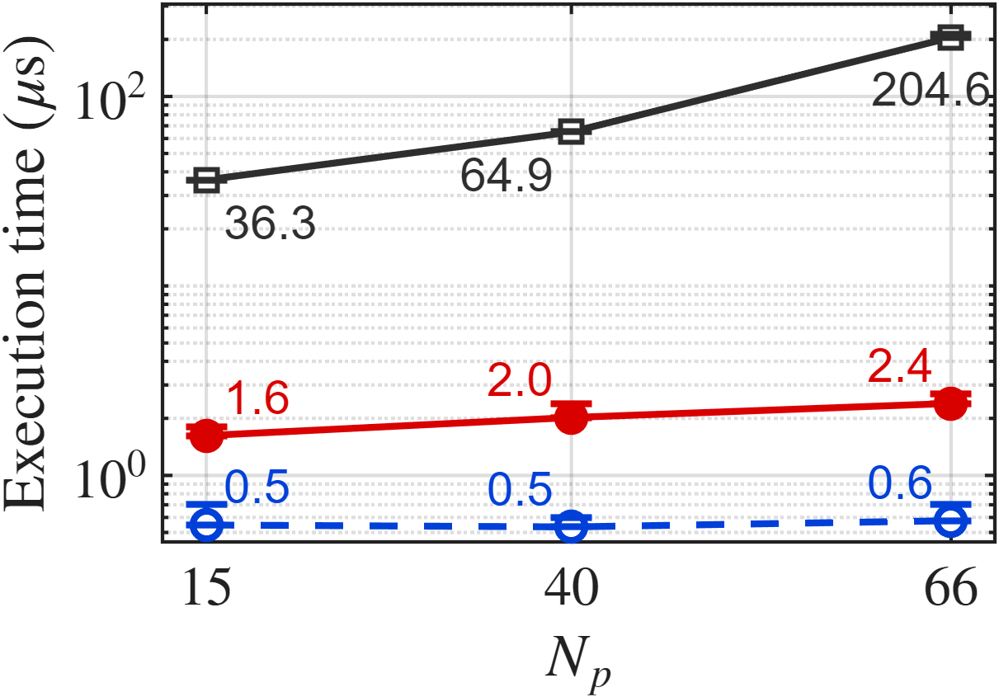

# certified-data-driven-feedback-sim

This repository provides simulation and evaluation code for the numerical study of **certified data-driven feedback synthesis under hard constraints**.

The proposed controller separates control admissibility from behavior realization. A **certified set-valued feedback map** returns a finite set of admissible control candidates at the current operating condition, and a **single-valued feedback law** combines these candidates to determine the applied control input. Hard-constraint feasibility is therefore built into the feedback structure.

<p align="center">
  
</p>

<p align="center">
  <em>Certified feedback structure used in the closed-loop implementation.</em>
</p>

The **lateral-vehicle benchmark** is used as a finite-horizon constrained-control specialization because it provides a complete closed-loop setting in which admissibility of the applied input depends on the existence of a feasible future continuation. This setting allows reference-behavior recovery, hard-constraint satisfaction, recursive feasibility, and online execution time to be evaluated together.

## Repository contents

```text
.
├─ paper_lateral_figures/                        # Figures generated for the lateral-vehicle benchmark
├─ simulate_lateral_controller.m                 # Runs the three-horizon simulations, reports statistics, and generates figures
├─ lateral_controller.mat                        # Precomputed controllers, certified law libraries, and deployed executor data
├─ lateral_simulation_results.mat                # Precomputed simulation results for the reported benchmark cases
├─ certnnmpc_executor_mex.mexw64                 # C-MEX implementation of the proposed and coverage-only controllers
├─ lateral_mpc_kwik_mex_Np15_Nc15.mexw64        # Condensed KWIK MPC baseline for Np = Nc = 15
├─ lateral_mpc_kwik_mex_Np40_Nc40.mexw64        # Condensed KWIK MPC baseline for Np = Nc = 40
└─ lateral_mpc_kwik_mex_Np66_Nc66.mexw64        # Condensed KWIK MPC baseline for Np = Nc = 66
```

## Tested environment

- **OS:** Microsoft Windows 11 Pro
- **CPU:** 12th Gen Intel(R) Core(TM) i7-12700KF (12 cores)
- **MATLAB:** MATLAB 25.1.0.2973910 (R2025a) Update 1
- **Required MATLAB toolboxes:** Model Predictive Control Toolbox; Optimization Toolbox; Statistics and Machine Learning Toolbox (used only for percentile-based timing and performance statistics).
- **MEX platform:** 64-bit Windows (`.mexw64`)

## Comparison fairness

Both controllers are evaluated as **compiled MEX implementations under the same closed-loop benchmark conditions**, including the vehicle model, hard constraints, sampling time, prediction horizon, initial conditions, and simulation duration. The reference MPC is used without retuning and is formulated as a condensed quadratic program solved using the **active-set solver `mpcActiveSetSolver` from the MATLAB Model Predictive Control Toolbox**, with code generated using MATLAB Coder. The proposed controller is deployed as a **C-MEX implementation**, and the compiled reference controller is denoted **MPC (MEX)**.

For both controllers, **the current state is used to compute one control action at each sampling instant**. The same untimed warm-up procedure is applied before measurement, and execution time is measured using `tic`/`toc` around the **state-to-action MEX call**. Plant propagation, data storage, constraint diagnostics, and full-sequence reconstruction are excluded. The reported times therefore represent the **measured end-to-end state-to-action latency** of the two compiled implementations under matched benchmark conditions.

## Running the simulation

1. Place all repository files in the same directory and set the MATLAB working directory to that folder.
2. In `simulate_lateral_controller.m`, select:

```matlab
runMode = "simulate";
```

3. Run:

```matlab
run simulate_lateral_controller
```

The script evaluates all three prediction horizons, prints the complete report, saves the results to `lateral_simulation_results.mat`, and exports the figures and summary files to `paper_lateral_figures/`.

To regenerate reports and figures without rerunning the simulations, keep `lateral_simulation_results.mat` in the same directory and use:

```matlab
runMode = "report_and_plot";
```

## Main benchmark results

The numerical study focuses on three aspects: **reference-behavior recovery**, **hard-constraint satisfaction and recursive feasibility**, and **online execution time**. The cross-horizon evaluation uses the same 50 held-out initial conditions for `Np = Nc = 15, 40, 66`.

| Metric | Np = 15 | Np = 40 | Np = 66 |
|---|---:|---:|---:|
| Median relative tracking-cost gap to MPC, Proposed | 5.8% | 1.3% | 1.0% |
| Median relative tracking-cost gap to MPC, Coverage-only | 26.0% | 94.2% | 268.6% |
| Mean-time speedup over MPC (MEX) | 22.4× | 32.1× | 85.3× |
| Hard-constraint violations | None observed | None observed | None observed |
| Recursive feasibility | Maintained | Maintained | Maintained |

Across the tested prediction horizons, the proposed controller remains close to the reference MPC behavior while satisfying the hard constraints and maintaining recursive feasibility. Its measured online execution time remains low, with an increasing timing advantage over MPC (MEX) as the prediction horizon grows.

### Representative closed-loop case

The figure below shows the representative case with `Np = Nc = 40`, including lateral tracking error, steering input, and per-step online execution time.

<p align="center">
  
</p>

<p align="center">
  <em>Representative closed-loop evaluation for Np = Nc = 40.</em>
</p>

For this case, the proposed controller achieves a tracking cost of `0.1281` compared with `0.1261` for MPC (MEX), while reducing the measured mean state-to-action time from `71.170 μs` to `2.587 μs`. The corresponding 95th-percentile times are `240.900 μs` and `3.400 μs`, respectively, with no observed hard-constraint violations.

### Cross-horizon trends

<p align="center">
  
  
</p>

<p align="center">
  <em>Reference-behavior recovery and measured online execution time across the three prediction horizons.</em>
</p>

Additional closed-loop trajectories, multi-initial-condition results, and deployed-library statistics are available in `paper_lateral_figures/`.
